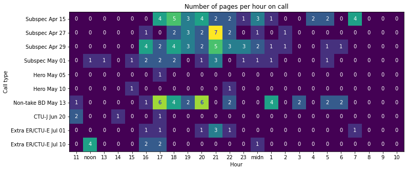

# call-heatmap
*Creates a heatmap of pages per hour on call based on my call logs*

Unfortunately this repository is not publicly usable, partially because it would be too niche for others to use, and partially because I don't want to publish my call logs.

## How it works

I use SMS Backup+ to back up my call logs to Gmail under the label "Call log". I used Google Takeout to export my call log to an mbox format file 'Call log.mbox'.

In the script, I hard-coded some of the in-hospital calls I've done, including their date/time and which hospital wards I cover. I respond to pages on these calls using my cellphone so that they are logged to Gmail.

The script returns a heatmap of average number of pages per hour, grouped by in-hospital call type.

